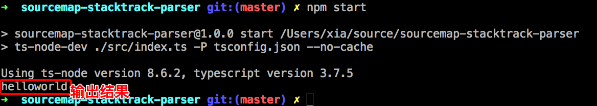

# 从0到1开发一个开源项目(TS + ESlint + Jest)

[toc]

## 搭建项目框架

### 创建文件夹

```bash
# 创建项目文件件
mkdir sourcemap-stacktrack-parser
# 创建README.md文件
echo "# sourcemap-stacktrack-parser" >> README.md
```


### 初始化git仓库

```bash
git init
# 添加README文件
git add README.md
# 提交代码
git commit -m "first commit"
# 设置远程仓库地址
git remote add origin git@github.com:su37josephxia/sourcemap-stacktrack-parser.git
# 推送代码
git push -u origin master

```


### 初始化npm

```bash
npm init -y
```

### 初始化tsc

#### 安装typescript包

```bash
npm i typescript ts-node-dev @types/node -d
```

#### 创建tsconfig.json文件

```json
{
    "compilerOptions": {
        "outDir": "./lib",
        "target": "es2017",
        "module": "commonjs",//组织代码方式
        "sourceMap": true,
        "moduleResolution": "node", // 模块解决策略
        "experimentalDecorators": true, // 开启装饰器定义
        "allowSyntheticDefaultImports": true, // 允许es6方式import
        "lib": ["es2015"],
        "typeRoots": ["./node_modules/@types"],
    },
    "include": ["src/**/*"]
}
```

#### 创建index.js文件

```js
mkdir src
echo 'console.log("helloworld")' >> src/index.ts
```

#### 添加npm脚本

在package.json文件中添加

```
"scripts": {
    "start": "ts-node-dev ./src/index.ts -P tsconfig.json --no-cache",
    "build": "tsc -P tsconfig.json",
}
```

#### git忽略lib文件

```bash
echo '/lib' >> .gitignore
```


#### 验证

```bash
npm start
```




### 初始化Jest测试

#### 安装jest库

```bash
npm install jest ts-jest @types/jest -d
```

#### 创建jestconfig.json文件

```json
{
  "transform": {
    "^.+\\.(t|j)sx?$": "ts-jest"
  },
  "testRegex": "(/__tests__/.*|(\\.|/)(test|spec))\\.(jsx?|tsx?)$",
  "moduleFileExtensions": ["ts", "tsx", "js", "jsx", "json", "node"]
}
```

####  package.json里的 scripts 下的 test 

```json
{
  "scripts": {
    "test": "jest --config jestconfig.json --watch",
  }
}
```


#### 源码中导出一个函数

```js
export const add = (a: number, b: number) => a + b
```

#### 创建测试用例

在src/\___tests\___文件夹中创建index.spec.ts

```js
import { add } from "../index";
test("Index add fun", () => {
    const ret = add(1, 2)
    console.log(ret)
    expect(ret).toBe(3);
});
```

#### 启动测试用例

```bash
npm run test
```


### 初始化Eslint


安装eslint包

```
npm install prettier tslint tslint-config-prettier -d
```
配置tslint.json
```json
{
  "extends": ["tslint:recommended", "tslint-config-prettier"],
  "rules": {
    "no-console": false, // 忽略console.log
    "object-literal-sort-keys": false,
    "member-access": false,
    "ordered-imports": false
  },
  "linterOptions": {
    "exclude": ["**/*.json", "node_modules"]
  }
}
```

#### 配置 .prettierrc

Prettier 是格式化代码工具。用来保持团队的项目风格统一。

```json
{
  "trailingComma": "all",
  "tabWidth": 4,
  "semi": false,
  "singleQuote": true,
  "endOfLine": "lf",
  "printWidth": 120,
  "overrides": [
    {
      "files": ["*.md", "*.json", "*.yml", "*.yaml"],
      "options": {
        "tabWidth": 2
      }
    }
  ]
}
```

####  配置.editorconfig

“EditorConfig帮助开发人员在不同的编辑器和IDE之间定义和维护一致的编码样式。EditorConfig项目由用于定义编码样式**的文件格式**和一组**文本编辑器插件组成**，这些**插件**使编辑器能够读取文件格式并遵循定义的样式。EditorConfig文件易于阅读，并且与版本控制系统配合使用。

对于VS Core，对应的插件名是[EditorConfig for VS Code](https://marketplace.visualstudio.com/items?itemName=EditorConfig.EditorConfig)

````bash
# EditorConfig is awesome: https://EditorConfig.org

# top-most EditorConfig file
root = true

# Unix-style newlines with a newline ending every file
[*]
end_of_line = lf
insert_final_newline = true
charset = utf-8
indent_style = space
indent_size = 4

[{*.json,*.md,*.yml,*.*rc}]
indent_style = space
indent_size = 2
````

添加script脚本

```json
{
  "scripts": {
    "format": "prettier --write \"src/**/*.ts\" \"src/**/*.js\"",
    "lint": "tslint -p tsconfig.json"
  }
}
```


### 设置 git 提交的校验钩子

#### 安装husky库

```js
npm install husky -d
```

#### 新建.huskyrc

```js
{
    "hooks": {
        "pre-commit": "npm run format && npm run lint && npm test"
    }
}
```

#### 验证结果


### 设置Travis CI

Travis CI 提供的是持续集成服务，它仅支持 Github，不支持其他代码托管。它需要绑定 Github 上面的项目，还需要该项目含有构建或者测试脚本。只要有新的代码，就会自动抓取。然后，提供一个虚拟机环境，执行测试，完成构建，还能部署到服务器。只要代码有变更，就自动运行构建和测试，反馈运行结果。确保符合预期以后，再将新代码集成到主干。

登录

登录https://www.travis-ci.org/网站

#### 测试覆盖率

```js
npm install codecov -d
```


## TDD方式编写功能


## 编写文档

### 编写README.md

#### README最佳实践

参考https://github.com/jehna/readme-best-practices/blob/master/README-default.md

#### 添加修饰图标

### 编写package.json描述信息

### JSdoc

## 添加开源许可证

每个开源项目都需要配置一份合适的开源许可证来告知所有浏览过我们的项目的用户他们拥有哪些权限，具体许可证的选取可以参照阮一峰前辈绘制的这张图表：


那我们又该怎样为我们的项目添加许可证了？其实 Github 已经为我们提供了非常简便的可视化操作: 	我们平时在逛 github 网站的时候，发现不少项目都在 [README.md](http://README.md) 中添加徽标，对项目进行标记和说明，这些小图标给项目增色不少，不仅简单美观，而且还包含清晰易懂的信息。

1. 打开我们的开源项目并切换至 **Insights** 面板
2. 点击 Community 标签
3. 如果您的项目没有添加 License，在 **Checklist** 里会提示您添加许可证，点击 **Add** 按钮就进入可视化操作流程了


## 提交与发布代码

### 提交git仓库

### 发布npm仓库